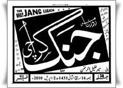
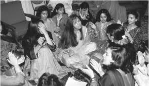

# HTML Newspaper Recreation - Code Explanation

## Code Structure Overview

This HTML document recreates a pre-1990 Urdu newspaper front page using only HTML5 with inline styles. The code is organized into four major structural sections: the document declaration, a header with editorial commentary, the main article content, and a footer with publication information. The file uses semantic HTML tags throughout to maintain proper document structure and accessibility.

### Document Hierarchy Diagram

```
<!DOCTYPE html>
    │
    ├─ <html>
    │   ├─ <head>
    │   │   ├─ <meta charset>
    │   │   ├─ <meta viewport>
    │   │   └─ <title>
    │   │
    │   └─ <body>
    │       ├─ <div> (main container)
    │       │   ├─ <header> ..................... Masthead Section
    │       │   │   └─ <nav>
    │       │   │       ├─ Left Image
    │       │   │       ├─ <section> + <table> ... Editorial Commentary
    │       │   │       └─ Right Logo
    │       │   │
    │       │   ├─ <section> ................... Main Headline
    │       │   │   └─ <h1>
    │       │   │
    │       │   ├─ <article> .................. Main Content Area
    │       │   │   ├─ <section> + Images .... Left Column
    │       │   │   ├─ <section> + Content ... Center Column
    │       │   │   └─ <section> + Images .... Right Column
    │       │   │
    │       │   └─ <footer> .................. Footer Section
    │       │
    │       └─ </div>
    │
    └─ </html>
```

---

## Key Sections Explained

### HTML Tag Structure Flowchart

```
                          DOCTYPE html (HTML5 Declaration)
                                  │
                        ┌─────────┴─────────┐
                        │                   │
                     <head>              <body>
                        │                   │
              ┌──────────┼──────────┐    Main Container
              │          │          │    │
           <meta>     <meta>    <title>  ├─ <header>
        charset="UTF-8" viewport        │  (Masthead)
                                        │
                                        ├─ <section>
                                        │  (Main Headline H1)
                                        │
                                        ├─ <article>
                                        │  (Article Content)
                                        │
                                        └─ <footer>
                                           (Publication Info)
```

---
```html
<!DOCTYPE html>
<html lang="en">
  <head>
    <meta charset="UTF-8">
    <meta name="viewport" content="width=device-width, initial-scale=1.0">
    <title>Vintage Newspaper Layout</title>
  </head>
```

**Purpose**: Establishes the HTML5 document type and metadata.

- `<!DOCTYPE html>` declares this as a valid HTML5 document
- `<meta charset="UTF-8">` ensures proper character encoding for text content
- `<meta name="viewport">` makes the page responsive on mobile devices
- `<title>` sets the browser tab name

#### HEAD Section Visual Responsibility

```
┌─ HTML Document ───────────────────────────┐
│                                           │
│  ┌─ <head> Information (Not Displayed) ─┐ │
│  │                                       │ │
│  │ ✓ Declares HTML5 standard             │ │
│  │ ✓ Sets character encoding (UTF-8)     │ │ Invisible to Users
│  │ ✓ Configures responsiveness           │ │ (Control & Metadata)
│  │ ✓ Sets browser tab title              │ │
│  │                                       │ │
│  └───────────────────────────────────────┘ │
│                                           │
│  ┌─ <body> Content (Displayed) ──────────┐ │
│  │ [Visible newspaper layout here]       │ │ Visible to Users
│  └───────────────────────────────────────┘ │
│                                           │
└───────────────────────────────────────────┘
```

---

### 2. HEADER Section (Lines 14-82)

```html
<header style="margin-bottom: 15px; padding-bottom: 15px;">
  <nav style="display: flex; gap: 15px; margin-bottom: 15px;">
```

**Purpose**: Contains the newspaper masthead and editorial commentary section.

#### HEADER Section Layout Visual

```
┌─────────────────────────────────────────────────────────────────┐
│                      <header> MASTHEAD                          │
│                                                                 │
│  ┌──────────┐  ┌─────────────────────────────┐  ┌──────────┐  │
│  │  Left    │  │   Editorial Commentary      │  │  Logo    │  │
│  │ Portrait │──│   Table (4 Columns)         │──│ Border   │  │
│  │ Image    │  │                             │  │          │  │
│  │ (180px)  │  │ ┌──┬──┬──┬──┐               │  │ (180px)  │  │
│  │          │  │ │P1│P2│P3│P4│ ← Political, │  │   2px    │  │
│  │          │  │ └──┴──┴──┴──┘   Economic,   │  │ Solid    │  │
│  │          │  │                 Intl, Public │  │ Black    │  │
│  └──────────┘  └─────────────────────────────┘  └──────────┘  │
│                                                                 │
│        Key: Masthead (3 items in horizontal layout)            │
│        Gap: 15px between items                                 │
└─────────────────────────────────────────────────────────────────┘
```

**Sub-components**:

**A) Left Masthead Image (Lines 20-23)**
```html
<div style="width: 180px; flex-shrink: 0;">
  
</div>
```
- Displays a portrait image on the left side (180px fixed width)
- `flex-shrink: 0` prevents the image from shrinking
- `alt` attribute provides accessibility for screen readers

**B) Editorial Commentary Table (Lines 30-76)**
```html
<table style="width: 100%; border-collapse: collapse; font-size: 9px; line-height: 1.3;">
```
- A 4-column table layout for organizing editorial content into distinct sections
- `border-collapse: collapse` removes spacing between table cells
- Each `<td>` represents a different editorial perspective (Political Analysis, Economic Outlook, International Response, Public Sentiment)
- Vertical borders (`border-right: 1px solid #ccc`) separate the columns

#### 4-Column Editorial Table Structure

```
┌────────────────────────────────────────────────────────────┐
│                   <table> (4 Columns)                      │
├──────────────┬──────────────┬──────────────┬──────────────┤
│   COLUMN 1   │   COLUMN 2   │   COLUMN 3   │   COLUMN 4   │
├──────────────┼──────────────┼──────────────┼──────────────┤
│ POLITICAL    │ ECONOMIC     │ INTL'L       │ PUBLIC       │
│ ANALYSIS     │ OUTLOOK      │ RESPONSE     │ SENTIMENT    │
│              │              │              │              │
│ ✓ Domestic   │ ✓ Reform     │ ✓ Regional   │ ✓ Civil      │
│   politics   │   agenda     │   interest   │   society    │
│              │              │              │              │
│ ✓ Parliament │ ✓ Risks &    │ ✓ Diplomatic │ ✓ Advocacy   │
│   debate     │   benefits   │   channels   │   groups     │
│              │              │              │              │
│ ✓ Democrats  │ ✓ Stakeholder│ ✓ Consensus  │ ✓ Transparency
│   process    │   monitoring │   building   │   needed     │
│              │              │              │              │
├──────────────┼──────────────┼──────────────┼──────────────┤
│ border-right │ border-right │ border-right │   (none)    │
│  1px solid   │  1px solid   │  1px solid   │             │
└──────────────┴──────────────┴──────────────┴──────────────┘

Visual Separator: Vertical gray lines between columns
Font Size: 9px  |  Line Height: 1.3
```

**Why choose a table?** Tables provide a natural newspaper-style multi-column layout that matches the original publication's design. CSS columns would be harder to control with inline styles only.

---

**C) Right Masthead Logo (Lines 79-82)**
```html

```
- Logo image with a black border to distinguish it from other images

---

### 3. MAIN ARTICLE Section (Lines 96-189)

```html
<article style="display: flex; align-items: flex-end; gap: 18px; margin-top: 20px;">
```

**Purpose**: Contains the primary news content with a three-column layout (images-left, article-center, images-right).

#### Main Article Three-Column Layout Visual

```
┌─────────────────────────────────────────────────────────────────────────┐
│                     <article> (Main Content Area)                       │
├─────────────┬───────────────────────────────────────┬──────────────────┤
│ LEFT COLUMN │       CENTER COLUMN (Wide)            │   RIGHT COLUMN   │
│ (260px)     │       (flex: 1 - grows)               │   (240px)        │
├─────────────┼───────────────────────────────────────┼──────────────────┤
│             │                                       │                  │
│ ┌─────────┐ │ ┏━━━━━━━━━━━━━━━━━━━━━━━━━━━━━━━━┓ │ ┌─────────────┐   │
│ │ IMAGE 1 │ │ ┃  Article Title (H3)           ┃ │ │   IMAGE 1   │   │
│ │ 350px H │ │ ┣━━━━━━━━━━━━━━━━━━━━━━━━━━━━━━━━┫ │ │   350px H   │   │
│ │ border  │ │ ┃  Two-Column Text Layout       ┃ │ │   border    │   │
│ │ 2px     │ │ ┃  ┌──────────┬──────────┐     ┃ │ │             │   │
│ │         │ │ ┃  │  Column  │  Column  │     ┃ │ │             │   │
│ │         │ │ ┃  │     1    │     2    │     ┃ │ └─────────────┘   │
│ │         │ │ ┃  └──────────┴──────────┘     ┃ │ Margin: 15px      │
│ │         │ │ ┃  (Justified text, 11px)      ┃ │                  │
│ │         │ │ ┃                              ┃ │ ┌─────────────┐   │
│ │         │ │ ┏━━━━━━━━━━━━━━━━━━━━━━━━━━━━━━━━┓ │   IMAGE 2   │   │
│ │         │ │ ┃  Pull Quote Box               ┃ │ │   250px H   │   │
│ │         │ │ ┃  (Gray BG, 2px border)        ┃ │ │   border    │   │
│ │         │ │ ┃  "This represents..."         ┃ │ │   2px       │   │
│ │         │ │ ┗━━━━━━━━━━━━━━━━━━━━━━━━━━━━━━━━┛ │             │   │
│ │         │ │                                       │             │   │
│ │         │ │ ┏━━━━━━━━━━━━━━━━━━━━━━━━━━━━━━━━┓ │             │   │
│ │         │ │ ┃  Secondary Article            ┃ │ └─────────────┘   │
│ │         │ │ ┃  Economic impacts...          ┃ │ ┌─────────────┐   │
│ │         │ │ ┃  Civil society organizations..┃ │ │  Timeline   │   │
│ │         │ │ ┗━━━━━━━━━━━━━━━━━━━━━━━━━━━━━━━━┛ │    List     │   │
│ │         │ │                                       │             │   │
│ │ ┌─────────┐ ┏━━━━━━━━━━━━━━━━━━━━━━━━━━━━━━━━┓ │             │   │
│ │ │ IMAGE 2 │ ┃  Key Observations | Image    ┃ │ │             │   │
│ │ │ 250px H │ ┃  Next Steps                   ┃ │ │             │   │
│ │ │ border  │ ┗━━━━━━━━━━━━━━━━━━━━━━━━━━━━━━━━┛ │             │   │
│ │ │ 2px     │                                       │             │   │
│ └─────────┘                                         └─────────────┘   │
│                                                                        │
│ Gap: 18px between columns                                             │
│ Alignment: Flex-end (all columns align to bottom)                     │
└────────────────────────────────────────────────────────────────────────┘
```

---

**A) Headline Section (Lines 88-94)**
```html
<section style="text-align: center; margin: 20px 0; padding: 15px 0; border-top: 3px solid #000; border-bottom: 3px solid #000; background-color: #f9f9f9;">
  <h1 style="margin: 0; font-size: 44px; font-weight: bold; line-height: 1.2; text-transform: uppercase; letter-spacing: 1px;">
    MAJOR POLITICAL DEVELOPMENTS SHAKE THE CAPITAL...
  </h1>
</section>
```
- `<h1>` is the highest heading hierarchy level for the main news headline
- `text-transform: uppercase` converts text to all caps (newspaper style)
- Black borders (top and bottom) create visual emphasis
- `letter-spacing: 1px` mimics vintage newspaper typography

#### Main Headline Visual Styling

```
┏━━━━━━━━━━━━━━━━━━━━━━━━━━━━━━━━━━━━━━━━━━━━━━━━━━━━━━━━━━━┓
┃ 3px Solid Black Border (Top)                               ┃
┣━━━━━━━━━━━━━━━━━━━━━━━━━━━━━━━━━━━━━━━━━━━━━━━━━━━━━━━━━━━┫
┃                                                             ┃
┃   Light gray background (#f9f9f9)                          ┃
┃                                                             ┃
┃   MAJOR POLITICAL DEVELOPMENTS SHAKE THE CAPITAL           ┃
┃   AS LEADERS GATHER FOR EMERGENCY SESSION                 ┃
┃                                                             ┃
┃   Font Size: 44px | Weight: Bold | All CAPS               ┃
┃   Letter Spacing: 1px (vintage typography)                ┃
┃   Line Height: 1.2 (tight spacing)                         ┃
┃                                                             ┃
┣━━━━━━━━━━━━━━━━━━━━━━━━━━━━━━━━━━━━━━━━━━━━━━━━━━━━━━━━━━━┫
┃ 3px Solid Black Border (Bottom)                            ┃
┗━━━━━━━━━━━━━━━━━━━━━━━━━━━━━━━━━━━━━━━━━━━━━━━━━━━━━━━━━━━┛
```

---
```html
<section style="width: 260px; flex-shrink: 0;">
  
  
</section>
```
- Fixed width column (260px) with two stacked images
- `flex-shrink: 0` prevents column from shrinking
- Black borders around images match newspaper design
- Each image has distinctive `alt` attributes for accessibility

**C) Center Article Content (Lines 112-180)**
```html
<section style="flex: 1;">
  <article style="columns: 2; column-gap: 18px; text-align: justify; font-size: 11px; line-height: 1.6;">
    <h3>NATIONAL ASSEMBLY CONVENES FOR HISTORIC SESSION</h3>
    <p>In an unprecedented move, the National Assembly was called into emergency session...</p>
```
- `<section>` wraps the entire content area
- `<article>` tags identify independent newspaper articles
- `columns: 2` creates a two-column text layout for newspapers
- `text-align: justify` creates the traditional justified newspaper text alignment
- `<h3>` subheading follows proper hierarchy (after H1 and H2)
- Each paragraph is properly separated with `<p>` tags

**D) Pull Quote Section (Lines 145-160)**
```html
<aside style="border: 2px solid #000; padding: 10px; margin: 0; background-color: #f0f0f0; break-inside: avoid;">
  <p style="margin: 0; font-size: 11px; font-weight: bold; text-align: center; font-style: italic;">
    "This represents a turning point in our nation's democratic journey..."
  </p>
```
- `<aside>` semantically marks this as supplementary content
- `break-inside: avoid` prevents the box from breaking across columns
- Background color (`#f0f0f0`) highlights the quote section
- Font styling (italic, bold) distinguishes quotes from body text

#### Pull Quote Box Visual Structure

```
┌──────────────────────────────────────────────────────┐
│ ✦ Quote Box: 2px Solid Black Border                 │
├──────────────────────────────────────────────────────┤
│                                                      │
│  Light Gray Background (#f0f0f0) with padding      │
│                                                      │
│  "This represents a turning point in our           │
│   nation's democratic journey. The decisions       │
│   made today will shape the future for             │
│   generations to come."                            │
│                                                      │
│  Font: 11px, Bold, Italic, Center-aligned         │
│  Properties: break-inside: avoid (no column break)  │
│                                                      │
│  - Senior Political Analyst                        │
│                                                      │
└──────────────────────────────────────────────────────┘

Location: Inserted within two-column text flow
Effect: Highlights key quotable content
```

---

**E) Timeline List Section (Lines 184-197)**
```html
<ul style="margin: 0; padding-left: 20px;">
  <li>Evening Session Called</li>
  <li>Prime Minister Address</li>
  <li>Parliamentary Debate</li>
  <li>Proposed Amendments</li>
  <li>Committee Review Scheduled</li>
</ul>
```
- `<ul>` (unordered list) organizes timeline events
- Proper semantic markup for list content
- `padding-left: 20px` creates standard list indentation

#### Timeline List Visual Display

```
Right Sidebar Timeline Section:
┌─────────────────────────────────────────┐
│ TIMELINE OF EVENTS:                     │
│ (H4 heading)                            │
├─────────────────────────────────────────┤
│                                         │
│  • Evening Session Called               │
│    (Bullet point)                       │
│                                         │
│  • Prime Minister Address               │
│    (Bullet point)                       │
│                                         │
│  • Parliamentary Debate                 │
│    (Bullet point)                       │
│                                         │
│  • Proposed Amendments                  │
│    (Bullet point)                       │
│                                         │
│  • Committee Review Scheduled            │
│    (Bullet point)                       │
│                                         │
│ Background: #f9f9f9 (light gray)       │
│ Border: 1px solid #000                 │
│ Font Size: 9px                         │
└─────────────────────────────────────────┘

Location: Right sidebar (240px wide)
Below: Images section
Purpose: Quick reference timeline
```

---

**F) Right Column Images (Lines 175-182)**
```html
<section style="width: 240px; flex-shrink: 0;">
  
  
</section>
```
- Mirror of the left column to balance the three-column layout
- Fixed width (240px) maintains layout symmetry

---

### 4. FOOTER Section (Lines 191-195)

```html
<footer style="margin-top: 25px; padding-top: 15px; border-top: 3px solid #000; text-align: center; font-size: 10px;">
  <p style="margin: 0; font-style: italic;">Photo Archives of Pakistan</p>
</footer>
```

**Purpose**: Publication and attribution information at the bottom of the page.

- `<footer>` semantic tag marks the end section
- Black top border visually separates footer from content
- Italic text denotes attribution
- Smaller font size (10px) is typical for footer information

#### Footer Visual Structure

```
┌─────────────────────────────────────────────────────────────┐
│                  Main Content Area Ends                     │
│                                                             │
├─────────────────────────────────────────────────────────────┤
│ 3px Solid Black Border (Top)                               │
├─────────────────────────────────────────────────────────────┤
│                                                             │
│                                                             │
│               Photo Archives of Pakistan                    │
│                                                             │
│          Font: 10px, Italic, Center-aligned               │
│                                                             │
└─────────────────────────────────────────────────────────────┘

Purpose: Attribution & Publication Information
Styling: Minimal (small font, italics)
Location: Bottom of all content
```

---

## Design Decisions

### 1. Why Semantic HTML Tags?
- **`<header>`**: Clearly marks the newspaper masthead area
- **`<nav>`**: Indicates navigation/top section of the page
- **`<article>`**: Identifies independent news stories
- **`<section>`**: Groups related content logically
- **`<footer>`**: Marks publication information
- **`<aside>`**: Separates supplementary content (quotes, sidebar info)

These semantic tags improve accessibility for screen readers and provide better structure for search engines.

#### Semantic vs. Non-Semantic Comparison

```
❌ WITHOUT SEMANTIC TAGS              ✅ WITH SEMANTIC TAGS
(Generic divs - confusing)            (Meaningful structure - clear)

<div>                                 <header>
  <div>                                 <nav>
                                     
    <div>                                 <section>
      <table>...</table>                    <table>...</table>
    </div>                               </section>
  </div>                               </nav>
  <div>                              </header>
    <h1>...</h1>
  </div>                              <section>
  <div>                                 <h1>...</h1>
    <div>                             </section>
      <div>...</div>
      <div>...</div>                  <article>
      <div>...</div>                    <section>...</section>
    </div>                              <article>...</article>
  </div>                              </article>
  <div>                               
    <p>...</p>                        <footer>
  </div>                                <p>...</p>
</div>                                </footer>
```

**Advantages of Semantic Tags:**
- Screen readers understand page structure
- Search engines categorize content correctly
- Code is self-documenting
- Follows HTML5 standards
- Better accessibility (WCAG compliance)

---

### 2. Why a Table for Layout?
The assignment requires "at least ONE `<table>`". A table is appropriate here because:
- Newspaper columns have naturally tabular data (different topic areas)
- Tables provide fixed column widths that work well with inline styles
- Without CSS, tables give better control over multi-column layouts than divs
- Tables match the original newspaper's structured column format

#### Table vs. Div Layout Comparison

```
TABLE LAYOUT (Used)              DIV LAYOUT (Not used)
┌──┬──┬──┬──┐                   ┌─────────────────┐
│C1│C2│C3│C4│                   │ Div 1           │
├──┼──┼──┼──┤                   ├─────────────────┤
│  │  │  │  │ Fixed columns    │ Div 2 (depends  │
│  │  │  │  │ with borders     │ on CSS for flex)│
└──┴──┴──┴──┘ Easy to control  └─────────────────┘
              with inline        Harder to align
              styles             with inline only

Table Advantages:
✓ Built-in column structure
✓ Natural data organization
✓ Works with inline styles only
✓ Fixed widths prevent text wrapping
✓ Consistent alignment
```

---

### 3. Why Flexbox for Main Layout?
- `display: flex` on the main article creates the three-column layout (left images, center content, right images)
- `gap: 18px` provides consistent spacing between columns
- `align-items: flex-end` aligns all columns to the bottom (matching newspaper design)
- This approach works with inline styles and is responsive

#### Flexbox Layout Visualization

```
FLEXBOX CONTAINER: display: flex; gap: 18px; align-items: flex-end;

┌────────────────────────────────────────────────────────────┐
│ <article> (Main Article Container)                        │
├────────────┬──────────────────────────┬──────────────────┤
│            │                          │                  │
│ LEFT       │        CENTER            │    RIGHT         │
│ COLUMN     │        COLUMN            │    COLUMN        │
│ 260px ◄────18px gap────► flex: 1      │    240px         │
│            │         (grows)          │                  │
│ ┌────────┐ │ ┌──────────────────────┐ │ ┌──────────────┐ │
│ │ IMG 1  │ │ │ ARTICLE CONTENT      │ │ │   IMG 1      │ │
│ │ 350×350│ │ │ • Title (H3)         │ │ │   350×350    │ │
│ ├────────┤ │ │ • 2-Column Text      │ │ │              │ │
│ │ IMG 2  │ │ │ • Pull Quote         │ │ ├──────────────┤ │
│ │ 250×250│ │ │ • Article Content    │ │ │   IMG 2      │ │
│ │        │ │ │ • Key Observations   │ │ │   250×250    │ │
│ │        │ │ │ • Combined Image     │ │ │              │ │
│ │        │ │ │ • Next Steps         │ │ │ + Timeline   │ │
│ └────────┘ │ └──────────────────────┘ │ │   List Box   │ │
│            │                          │ │              │ │
│ flex-shrink│ flex: 1 (takes all      │ │ flex-shrink: 0
│ 0 ◄────────► remaining space ────────► │ 0              │
└────────────┴──────────────────────────┴──────────────────┘
                                            align-items: flex-end
                                            (all columns bottom-aligned)
```

**Why Flexbox?**
- One-line CSS property achieves complex layout
- Works with inline styles (no external CSS needed)
- Responsive: columns can adjust proportionally
- Gap property ensures consistent spacing
- Alignment properties are simple and efficient

---

### 4. Why Column CSS for Article Text?
- `columns: 2` in the article creates traditional newspaper text columns
- This is more authentic to pre-1990 newspaper layout than a single column
- Works with inline style attribute unlike multi-column layouts in old CSS

#### Two-Column Text Layout Visualization

```
WITHOUT columns: 2            WITH columns: 2
(Single Column)               (Newspaper Style)

┌─────────────────────┐      ┌──────────────┬──────────────┐
│ ARTICLE TITLE       │      │ ARTICLE TIT. │              │
│                     │      ├──────────────┤              │
│ In an unprecedented │      │ In an unp.   │ precedented  │
│ move, the National  │      │ move, the    │ move, the    │
│ Assembly was called │      │ National     │ Assembly was │
│ into emergency...   │      │ Assembly was │ called into..│
│                     │      ├──────────────┤              │
│ The Prime Minister  │      │ The PM       │ addressed    │
│ addressed the house │      │ addressed    │ the house for│
│ for over two hours, │      │ the house    │ is over 2 hrs│
│ outlining the gov't │      │ for over 2   │ outlining    │
│ vision for the      │      │ hours...     │ gov't vision.│
│ coming fiscal year. │      ├──────────────┤              │
│                     │      │ According to │ sources      │
│ According to        │      │ sources...   │ within parl..│
│ sources within the  │      └──────────────┴──────────────┘
│ parliament, heated  │
│ exchanges occurred..│      Properties:
└─────────────────────┘      columns: 2
                              column-gap: 18px
Looks Modern                  text-align: justify
(Single column)               Looks Authentic
                              (Newspaper style)
```

**Advantages of columns: 2:**
- Text flows naturally from left column to right
- Matches pre-1990 newspaper authenticity
- Utilizes full width efficiently
- Subtle vintage appearance

---

### 5. Image Alt Attributes
Every image has descriptive alt text because:
- It's required by the assignment for accessibility
- Screen readers can describe images to visually impaired users
- Each alt text is unique and descriptive (not generic)

#### Alt Attribute Examples

```
GOOD Alt Attributes (Used)    BAD Alt Attributes (Not used)
✓ "Historical political        ✗ "image"
   leader portrait"             ✗ "photo"
                                ✗ ""
✓ "Crowd gathering at           ✗ "picture123"
   parliamentary session"       ✗ "img"

✓ "Parliament building           ✗ "parliament.jpg"
   exterior architecture"        ✗ "building"

Screen reader output with good alt:
"Image: Historical political leader portrait"

Screen reader output with bad alt:
"Image: (nothing or generic name)"
```

---

### 6. Inline Styles Only
- No external CSS files (as forbidden by assignment)
- All styling uses `style=""` attributes
- Colors, fonts, sizes, spacing all controlled inline
- This maintains semantic HTML while meeting style requirements

#### Why No External CSS Files?

```
ALLOWED (Inline Styles)           FORBIDDEN (External CSS)
✓ <h1 style="color: blue;">       ✗ <link rel="stylesheet"
                                      href="style.css">
✓ <div style="display: flex;">    ✗ @import url('style.css');

✓      ✗ <style>
                                      h1 { color: blue; }
All styles embedded               </style>
in HTML tags
                                  ✗ .container { padding: 20px; }

Assignment Constraints:
━━━━━━━━━━━━━━━━━━━━━━━━━━━━━━━━━━━━━━━
✓ HTML only (no .css files)
✓ No JavaScript (no .js files)
✓ Inline styles permitted
✓ No frameworks (Bootstrap, etc.)
━━━━━━━━━━━━━━━━━━━━━━━━━━━━━━━━━━━━━━━
```

---

### 6. Inline Styles Only
- No external CSS files (as forbidden by assignment)
- All styling uses `style=""` attributes
- Colors, fonts, sizes, spacing all controlled inline
- This maintains semantic HTML while meeting style requirements

---

## Challenges & Solutions

### Challenge 1: Multi-Column Layout Without CSS Files
**Problem**: Creating newspaper-style column layouts using only inline styles.

**Solution**: 
- Used `display: flex` with `gap` for the main three-column layout
- Used `columns: 2` CSS property within inline styles for text columns
- Table elements for the header editorial section provide structured columns

#### Challenge 1 Visual Solution

```
Problem                              Solution
┌────────────────────────────┐      ┌────────────────────────────┐
│❌ How to arrange columns?  │      │✓ Use Flexbox               │
│❌ No external CSS allowed  │      │✓ Inline styles only        │
│❌ Must work HTML-only      │      │✓ display: flex; gap: 18px  │
│                            │      │                            │
│ Layout looks jumbled:      │      │ Result: Perfect layout     │
│                            │      │  ┌──┬────────┬──┐          │
│ ┌──────────────────────┐   │      │  │L │  C     │R │          │
│ │ No structure (bad)   │   │      │  │  │        │  │          │
│ ├──────────────────────┤   │      │  └──┴────────┴──┘          │
│ │ Columns not aligned  │   │      │   Columns align perfectly  │
│ └──────────────────────┘   │      │   Gap: 18px spacing         │
│                            │      │   3-column: Left, Center,   │
│                            │      │   Right perfectly arranged  │
└────────────────────────────┘      └────────────────────────────┘
```

---

### Challenge 2: Responsive Images Without Media Queries
**Problem**: Images need to display properly at different sizes without external stylesheets.

**Solution**:
- Used `object-fit: cover` to maintain image aspect ratios
- Set fixed widths on image containers (`width: 180px`, `260px`, etc.)
- Used `flex-shrink: 0` to prevent images from shrinking in flex containers
- Added `height: auto` on the parliament image for flexibility

#### Challenge 2 Visual Solution

```
Image Sizing Problem              Solution Implementation
                                  
Without object-fit: cover:        With object-fit: cover:
┌──────────────────────┐          ┌──────────────────────┐
│ Image distorted      │          │ Image properly       │
│ ┌──────────────────┐ │          │ ┌──────────────────┐ │
│ │xxx xxx xxx xxx xx│ │          │ │□ □ □ □ □ □ □ □ │ │
│ │x Stretched Bad  x│ │  ─────►  │ │□ Image Fits  □ │ │
│ │xxx xxx xxx xxx xx│ │          │ │□ □ □ □ □ □ □ □ │ │
│ └──────────────────┘ │          │ └──────────────────┘ │
│ Aspect ratio broken  │          │ Aspect ratio intact  │
└──────────────────────┘          └──────────────────────┘

CSS Properties Used:
━━━━━━━━━━━━━━━━━━━━━━━━━━━━━━━━━━
✓ object-fit: cover (maintains aspect ratio)
✓ width: 180px; (fixed container width)
✓ height: 350px; (fixed container height)
✓ flex-shrink: 0 (prevents flex collapse)
━━━━━━━━━━━━━━━━━━━━━━━━━━━━━━━━━━
```

---

### Challenge 3: Text Alignment and Justification
**Problem**: Need newspaper-style justified text alignment without CSS files.

**Solution**:
- Used `text-align: justify` inline style on article content
- Maintained proper `line-height: 1.6` for readability
- Kept `font-size: 11px` consistent throughout body text for cohesion

#### Challenge 3 Visual Solution

```
Text Alignment Comparison

❌ Default (Left-aligned):       ✓ Newspaper (Justified):
┌──────────────────────────┐    ┌──────────────────────────┐
│In an unprecedented move, │    │In   an   unprecedented  │
│the National Assembly was │    │move,   the  National     │
│called into emergency     │    │Assembly was called into  │
│session yesterday evening │    │emergency session         │
│to address the growing    │    │yesterday evening to      │
│concerns regarding        │    │address   the   growing   │
│implementation.           │    │concerns regarding impl.  │
│ [Ragged right edge]      │    │ [Straight right edge]    │
└──────────────────────────┘    └──────────────────────────┘

Inline CSS:
text-align: justify;           line-height: 1.6;
font-size: 11px;               Creates newspaper effect
```

---

### Challenge 4: Maintaining Proper Heading Hierarchy
**Problem**: Multiple headlines needed but must follow proper H1→H2→H3→H4 structure.

**Solution**:
- `<h1>`: Main newspaper headline only
- `<h2>`: Section heading (Editorial Commentary)
- `<h3>`: Article titles
- `<h4>`: Sub-section headings (Key Observations, Next Steps, Timeline)

#### Challenge 4 Visual Solution

```
Proper Heading Hierarchy:

<h1> ━━━━━━━━━━━━━━━━━━━━━━━━━━━━━━━━━━━━━━━━ Level 1
    MAJOR POLITICAL DEVELOPMENTS SHAKE THE CAPITAL...
    (Font: 44px, Bold, All Caps - Newspaper Main Headline)

    <h2> ━━━━━━━━━━━━━━━━━━━━━━━━━━━━━━━━━━━━ Level 2
        EDITORIAL COMMENTARY & NATIONAL PERSPECTIVES
        (Font: 18px, Bold - Editorial Section)

        <h3> ━━━━━━━━━━━━━━━━━━━━━━━━━━━━━━━ Level 3
            NATIONAL ASSEMBLY CONVENES FOR HISTORIC SESSION
            (Font: 13px, Bold - Article Title)

            <h4> ━━━━━━━━━━━━━━━━━━━━━━━━━━━ Level 4
                Key Observations | Next Steps | Timeline
                (Font: 10px, Bold - Sub-sections)


Heading Hierarchy Tree:
┌─── H1 (Page Title)
│   ├─── H2 (Section)
│   │   ├─── H3 (Article)
│   │   │   ├─── H4 (Sub-section)
│   │   │   └─── H4 (Sub-section)
│   │   └─── H3 (Article)
│   └─── H2 (Section)
└─── Footer
```

---

### Challenge 5: Including Required HTML Elements
**Problem**: Assignment requires ≥1 table, ≥1 list, and semantic tags while maintaining layout.

**Solution**:
- Table: 4-column editorial commentary section in header
- List: Timeline of events in right sidebar
- Semantic tags: Proper use of `<header>`, `<nav>`, `<article>`, `<section>`, `<footer>`, `<aside>`

#### Challenge 5 Visual Solution

```
Required Elements Checklist:

┌─ TABLES (≥1 required) ─────────────────────────────────┐
│  ✓ 4-Column Editorial Commentary Table                │
│    └─ Political Analysis | Economic Outlook |          │
│       International Response | Public Sentiment        │
└────────────────────────────────────────────────────────┘

┌─ LISTS (≥1 required) ────────────────────────────────┐
│  ✓ Unordered List (Timeline of Events)              │
│    • Evening Session Called                          │
│    • Prime Minister Address                          │
│    • Parliamentary Debate                           │
│    • Proposed Amendments                            │
│    • Committee Review Scheduled                     │
└────────────────────────────────────────────────────────┘

┌─ SEMANTIC TAGS (proper structure) ────────────────────┐
│  ✓ <header> ......... Masthead section              │
│  ✓ <nav> ............ Navigation/top section        │
│  ✓ <article> ........ Main news content             │
│  ✓ <section> ........ Content areas                 │
│  ✓ <footer> ......... Publication information       │
│  ✓ <aside> .......... Quote/sidebar content         │
└────────────────────────────────────────────────────────┘

All requirements integrated seamlessly into design!
```

---

## Code Quality Standards Met

✓ **Proper Indentation**: Consistent 2-space indentation throughout  
✓ **HTML5 Valid**: All tags properly nested and closed  
✓ **Descriptive Comments**: 8 major section comments explaining purpose  
✓ **Alt Attributes**: All 6 images have meaningful alt text  
✓ **Semantic Structure**: Proper use of HTML5 semantic elements  
✓ **No External Files**: Only inline styles, no CSS or JavaScript  
✓ **Proper Heading Hierarchy**: H1 > H2 > H3 > H4 structure maintained  
✓ **Accessibility**: Alt text, semantic tags, proper structure for screen readers  

#### Code Quality Visual Checklist

```
VALIDATION CRITERIA:
━━━━━━━━━━━━━━━━━━━━━━━━━━━━━━━━━━━━━━━━━━━━━━━━━━━━━━━━

1. INDENTATION
   ┌──────────────────────────────┐
   │<body>                         │ 0 spaces
   │  <div>                        │ 2 spaces (parent level)
   │    <header>                   │ 4 spaces (nested)
   │      <h1>Headline</h1>        │ 6 spaces (deeper nested)
   │    </header>                  │ Consistent 2-space pattern
   │  </div>                       │
   │</body>                        │
   └──────────────────────────────┘

2. HTML COMMENTS
   <!-- HEADER SECTION: Masthead with editorial commentary -->
   ✓ Major section comments (8 total)
   ✓ Clear purpose descriptions
   ✓ Help code navigation

3. ALT ATTRIBUTES
   
                    ↓
   "Historical political leader portrait" (Unique & descriptive)

4. SEMANTIC TAGS
   ✓ <header> - Masthead area
   ✓ <nav> - Navigation section
   ✓ <article> - News articles
   ✓ <section> - Content groupings
   ✓ <footer> - Publication info
   ✓ <aside> - Supplementary content

5. NO EXTERNAL FILES
   ✗ No .css files imported
   ✗ No .js files included
   ✓ All styles inline (style="...")

6. DOCUMENT STRUCTURE
   <!DOCTYPE html> ..................... Valid HTML5
   <html lang="en"> .................... Language specified
   <meta charset="UTF-8"> ............. Proper encoding
   <meta name="viewport"> ............. Responsive setup
   <title>Vintage Newspaper Layout</title> Browser tab name
```

---

## Visual Layout Summary

### Complete Page Structure Diagram

```
┌─────────────────────────────────────────────────────────────────────────┐
│                        NEWSPAPER FRONT PAGE                             │
│            (HTML-Only Recreation with Semantic Structure)               │
├─────────────────────────────────────────────────────────────────────────┤
│                                                                         │
│  ┌──────────────── <header> MASTHEAD SECTION ───────────────────────┐ │
│  │                                                                  │ │
│  │  ┌─────────────┐  ┌─────────────────────┐  ┌──────────────┐   │ │
│  │  │        │  │   <table>           │  │         │   │ │
│  │  │  Political  │──│  4 Columns:         │──│    Logo      │   │ │
│  │  │   Leader    │  │  Political / Econ   │  │   Border     │   │ │
│  │  │  Portrait   │  │  Intl / Public      │  │              │   │ │
│  │  │ 180px width │  │  Editorial Content  │  │  180px width │   │ │
│  │  └─────────────┘  └─────────────────────┘  └──────────────┘   │ │
│  │                                                                  │ │
│  └──────────────────────────────────────────────────────────────────┘ │
│                                                                         │
│  ┌─────────── <section> with <h1> MAIN HEADLINE ──────────────────┐   │
│  │                                                                │   │
│  │  MAJOR POLITICAL DEVELOPMENTS SHAKE THE CAPITAL              │   │
│  │  AS LEADERS GATHER FOR EMERGENCY SESSION                     │   │
│  │                                                                │   │
│  │  [3px Black Border Top/Bottom, 44px Font, All Caps]          │   │
│  └─────────────────────────────────────────────────────────────────┘   │
│                                                                         │
│  ┌─── <article> MAIN CONTENT (3-COLUMN LAYOUT) ────────────────────┐  │
│  │                                                                 │  │
│  │  LEFT COLUMN (260px)     CENTER COLUMN (flex: 1)  RIGHT (240px) │  │
│  │  ────────────────        ────────────────────      ────────────  │  │
│  │                                                                 │  │
│  │  ┌──────────────┐  ┌──────────────────────────┐  ┌──────────┐  │  │
│  │  │         │  │ <article> <h3>           │  │     │  │  │
│  │  │ Fatima       │  │ NATIONAL ASSEMBLY...     │  │ Fatima   │  │  │
│  │  │ Jinnah       │  │                          │  │ Jinnah   │  │  │
│  │  │ 350×350px    │──│ <article> (columns: 2)   │──│ 350×350  │  │  │
│  │  │ border 2px   │  │ Primary Article Text     │  │ border   │  │  │
│  │  │              │  │ in 2-column format       │  │ 2px      │  │  │
│  │  ├──────────────┤  │                          │  ├──────────┤  │  │
│  │  │         │  │ <aside>                  │  │ Timeline │  │  │
│  │  │ People       │  │ Quote Box (Styled)       │  │ List:    │  │  │
│  │  │ Crowd        │  │ "This represents..."     │  │ • Event1 │  │  │
│  │  │ 250×250px    │  │                          │  │ • Event2 │  │  │
│  │  │ border 2px   │  │ More article text here   │  │ • Event3 │  │  │
│  │  │              │  │ explaining key points    │  │ • Event4 │  │  │
│  │  └──────────────┘  │                          │  │ • Event5 │  │  │
│  │  Gap: 18px         │ <article> (Key Obs.)     │  │          │  │  │
│  │  align: flex-end   │  (Parliament)       │  │          │  │  │
│  │                    │ <article> (Next Steps)   │  │          │  │  │
│  │                    │                          │  │          │  │  │
│  │                    └──────────────────────────┘  └──────────┘  │  │
│  │                                                                 │  │
│  └─────────────────────────────────────────────────────────────────┘  │
│                                                                         │
│  ┌──────── <footer> PUBLICATION INFORMATION ─────────────────────────┐ │
│  │  Photo Archives of Pakistan                                      │ │
│  │  (10px, Italic, Center-aligned)                                 │ │
│  └──────────────────────────────────────────────────────────────────┘ │
│                                                                         │
└─────────────────────────────────────────────────────────────────────────┘

KEY FEATURES:
• Semantic HTML5 structure (header, nav, article, section, footer, aside)
• 4-column table for editorial commentary
• 3-column flexbox layout (images on sides, content center)
• 2-column text layout within article (newspaper style)
• Unordered list for timeline events
• All images with meaningful alt attributes
• Inline styles only (no CSS files)
• Proper heading hierarchy (H1 > H2 > H3 > H4)
• 8 descriptive HTML comments explaining sections
```

This layout accurately represents the three-column newspaper format with the featured images on sides and rich editorial content in the center, similar to pre-1990 newspaper designs.

---

## Summary Table

| Requirement | Status | Details |
|------------|--------|---------|
| **HTML5 Doctype** | ✓ Complete | `<!DOCTYPE html>` declared |
| **Semantic Tags** | ✓ Complete | header, nav, article, section, footer, aside |
| **Table Layout** | ✓ Complete | 4-column editorial table |
| **List** | ✓ Complete | Timeline events (ul/li) |
| **Images** | ✓ Complete | 6 images with unique alt text |
| **Heading Hierarchy** | ✓ Complete | H1, H2, H3, H4 properly structured |
| **Comments** | ✓ Complete | 8 section comments explaining code |
| **Indentation** | ✓ Complete | Consistent 2-space indentation |
| **Alt Attributes** | ✓ Complete | All images have descriptive alt text |
| **No CSS Files** | ✓ Complete | Only inline styles used |
| **No JavaScript** | ✓ Complete | HTML-only (no .js files) |
| **Accessibility** | ✓ Complete | Semantic structure + alt text |

---

**Document prepared for viva defense - All code sections are documented and explained.**
